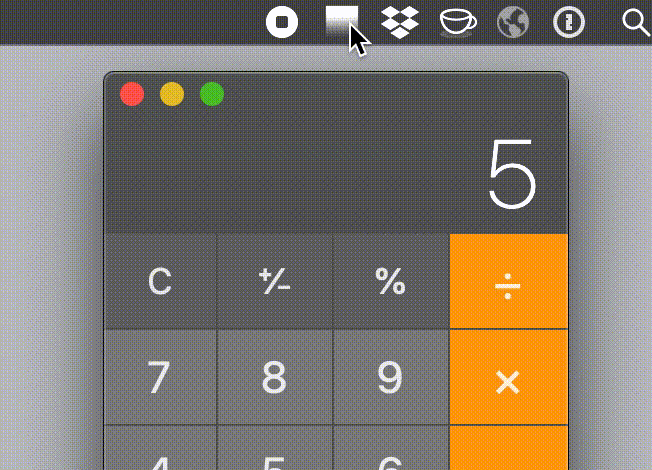

# DimMyScreen 😎

Dim your Mac -- goes below minimum brightness. Made for night owls, by a night owl.

Decided to make this because I couldn't find a simple, Mac-only/-optimized, open-source application.

## References

- Drew a lot of inspiration & copied overlay routine from [SPF](https://github.com/tannerc/spf).
- A neat cross-platform option is [Desktop Dimmer](https://github.com/sidneys/desktop-dimmer).
- Branding inspired by one of my favorite utilities, [KeepingYouAwake](https://github.com/newmarcel/KeepingYouAwake).

